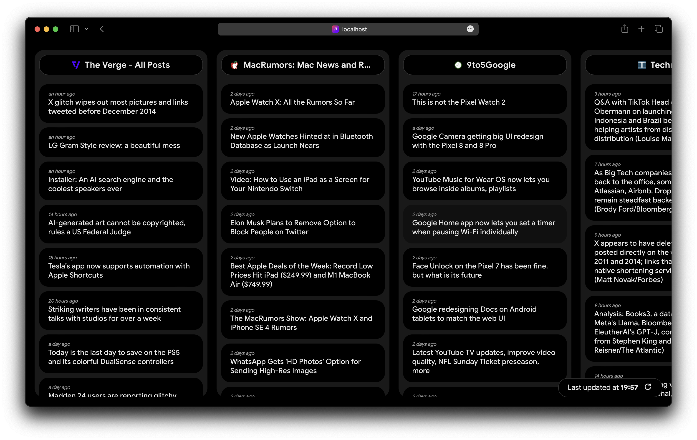

## Start. — TweetDeck-like RSS News Reader

Start. is a web-based application designed to provide a streamlined and organized way to read and manage multiple RSS news feeds. Inspired by the user-friendly interface of [TweetDeck](https://tweetdeck.twitter.com/), Start. offers a similar experience for consuming news content from various sources in a single dashboard.

## Features
**Multi-Column Layout**. Much like TweetDeck's column-based interface, Start. lets you arrange and customize your news feeds in multiple columns. 

**Responsive Design**. Enjoy a seamless reading experience across devices. Start.'s responsive design adapts to different screen sizes, from desktops to tablets and smartphones.

**Fixed Source Set**. Start. currently supports the following fixed set of **tech** news sources:

1. The Verge
2. MacRumors
3. 9to5Google
4. Techmeme
5. TechCrunch
6. Hacker News
7. Reddit (r/android, r/apple, r/technology, r/artificial)

## Getting Started
To run Start. locally, follow these steps:

1. Clone the repository: git clone https://github.com/anton0kurilov/start.git
2. Install dependencies: ``npm install``
3. Configure your RSS feed sources in the ``public/assets/data/sources.json`` file.
4. Start the development server: npm start
5. Access Start in your browser at http://localhost:1234
