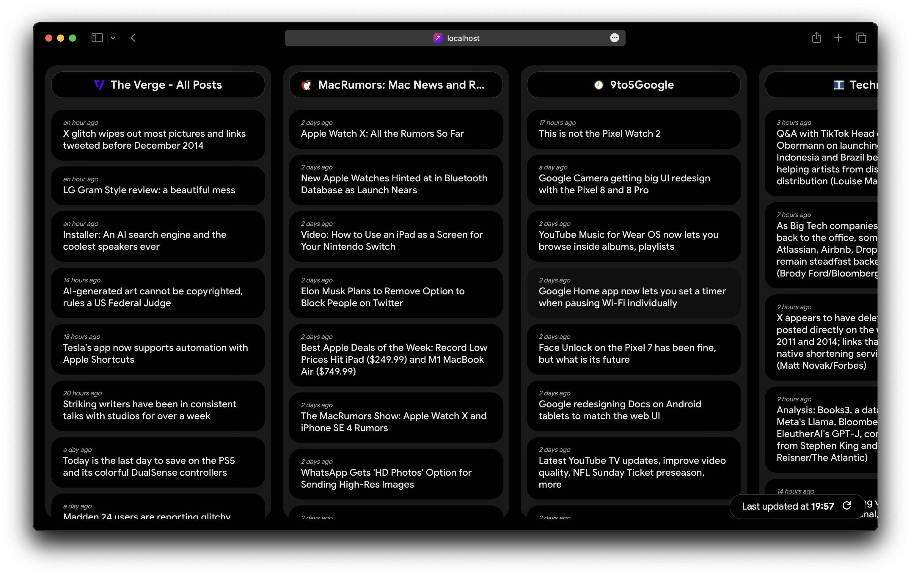

# Start.

### Простой RSS-ридер с колонками в духе TweetDeck



## Что умеет

- Колонки по папкам: каждая папка рендерится отдельной колонкой.
- Ручное управление источниками: создание, изменение и удаление колонок и
  RSS-подписок.
- Ручное и автоматическое обновление RSS-лент.
- Отметка прочитанных публикаций и скрытие нерелевантных материалов.
- Локальные рекомендации на основе истории взаимодействий.
- Сохранение состояния в `localStorage` (без бэкенда).
- Импорт и экспорт настроек в JSON.
- Установка как PWA.

## Технологии

- JavaScript (ES Modules)
- SCSS
- Parcel

## Быстрый старт

```bash
npm install
npm run dev
```

Приложение будет доступно по адресу `http://localhost:1234`.

## Скрипты

- `npm run dev` / `npm start` — запуск dev-сервера Parcel.
- `npm run build` — production-сборка в `dist/`.
- `npm run test:smoke` — быстрые smoke-тесты на `node:test`.

## Структура проекта

```text
public/index.html          # точка входа
public/assets/icons/       # PWA manifest, иконки и скриншот
src/scripts/main.js        # инициализация и обработчики UI-событий
src/scripts/domain.js      # загрузка/парсинг RSS и бизнес-логика
src/scripts/model-state.js # локальная модель рекомендаций
src/scripts/ui.js          # рендер интерфейса
src/scripts/storage.js     # localStorage
src/styles/                # SCSS-стили
tests/smoke/               # smoke-тесты на node:test
dist/                      # production-сборка (генерируется)
```
